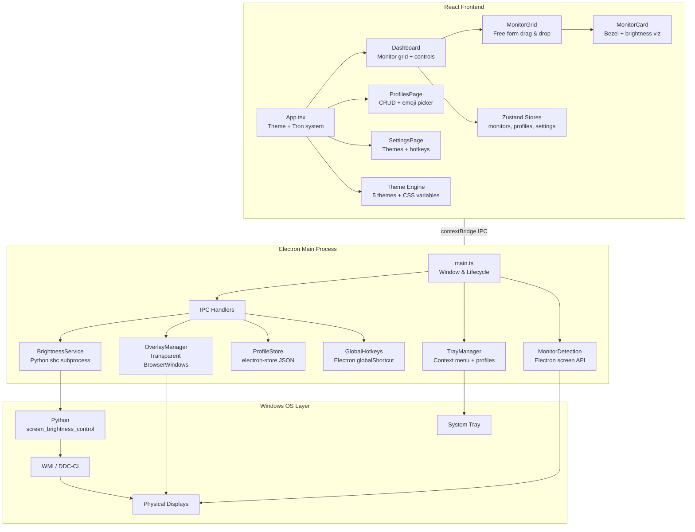
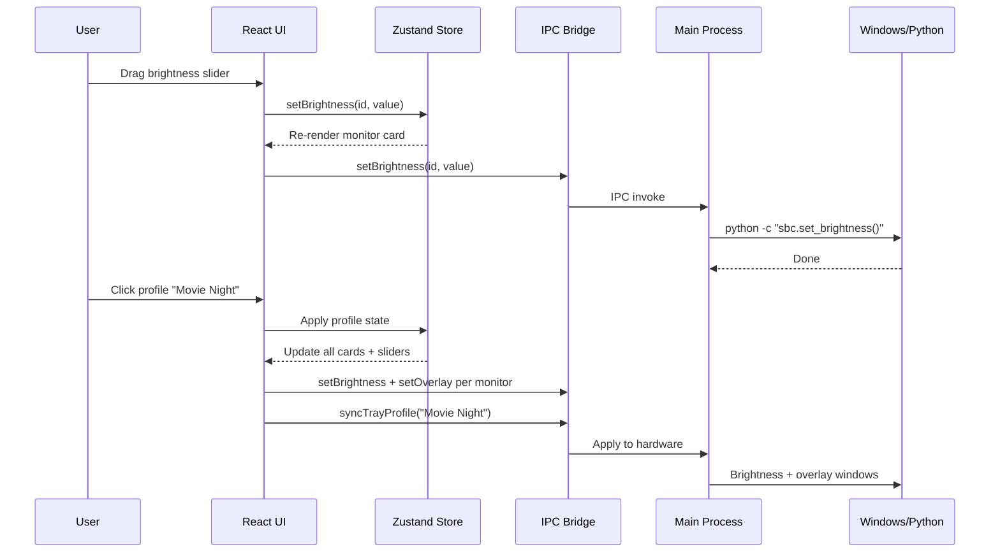

# MonitorShade

**Take control of your screen brightness.** MonitorShade lets you dim any monitor on your Windows PC — individually, beyond what your hardware allows — and save your favorite setups as one-click profiles.

Whether you're reducing eye strain at night, setting up a dark room for movies, or just want your side monitors dimmer while you work, MonitorShade has you covered.

---

## Getting Started

### Download & Install

| Method | How |
|---|---|
| **Installer** | Run `MonitorShade Setup 2.0.0.exe` — picks your install folder, adds a Start Menu shortcut |
| **Portable** | Run `MonitorShade.exe` from the `win-unpacked` folder — nothing installed, just run it |

Both are in the `screendim/release/` folder.

### Requirements

- **Windows 10 or 11**
- **Python 3.8+** (optional) — only needed if you want to control your monitor's *actual hardware brightness* via DDC/CI. Install the dependency with:

```
pip install screen-brightness-control
```

If you skip Python, the **dark overlay** still works — it places a transparent tinted layer over your screen to reduce brightness visually.

---

## How It Works

MonitorShade gives you two ways to dim a screen:

| Method | What it does | Python required? |
|---|---|---|
| **Hardware brightness** | Talks directly to your monitor to change its backlight level (0–100%) | Yes |
| **Dark overlay** | Places a transparent colored layer on top of your screen, dimming it beyond what the hardware slider can reach | No |

You can use either or both at the same time. The overlay is especially useful for screens that don't support DDC/CI (like many laptops) or when you need to go *darker than dark*.

### Overlay colors

The overlay isn't just black — pick a tint that suits the mood:

| Color | Best for |
|---|---|
| **Black** | General dimming |
| **Warm** | Comfortable nighttime use |
| **Amber** | Reducing blue light |
| **Night Blue** | Subtle cool tone |
| **Darkroom** | Red light for dark-adapted eyes |
| **Sepia** | Warm, paper-like tone for reading |

---

## Using the App

### The Dashboard

When you open MonitorShade, you see a visual layout of your monitors. Each one shows its current brightness and has its own slider.

- **Click a monitor** to select it, then adjust its brightness or overlay independently
- **"Control All" toggle** — adjust every monitor at once
- **Drag monitors** around the canvas to match how they're arranged on your desk
- **Double-click a monitor's name** to rename it (e.g., "Display 2" → "Right Ultrawide")

### Modes

| Mode | Behavior |
|---|---|
| **Auto** | Set your brightness/overlay levels and they stay put |
| **Toggle** | Switch between two brightness presets with a hotkey — great for quickly going dim ↔ bright |

### Profiles

Save any combination of per-monitor brightness, overlay, and mode as a **profile**:

1. Set up your monitors how you like
2. Click **Save** and give it a name + emoji (e.g., 🎬 Movie Night)
3. Switch back to it anytime with one click — from the app or the system tray

### System Tray

When you close the window, MonitorShade keeps running in your system tray (the little icons near your clock). Right-click the tray icon to:

- Switch between saved profiles
- Reset all monitors to full brightness
- Open the app or quit entirely

### Global Hotkeys

Set a keyboard shortcut (like `Ctrl+Shift+D`) in **Settings** to toggle brightness without switching windows. Works even when MonitorShade is in the background.

### Themes

Five built-in color themes: **Dark**, **Light**, **Midnight**, **Forest**, and **Georgia Tech**. When your screens get dim, the UI automatically shifts to high-contrast "Tron mode" so controls stay readable.

You can also drag-and-drop a custom logo onto the sidebar to personalize each theme.

---

## What's New in v2.0

Complete rewrite from the original Python app to a modern desktop application. Highlights:

- Free-form monitor arrangement with drag-and-drop
- Profile system with emoji icons and system tray switching
- Per-monitor dark overlays with 6 color tints
- 5 themes with animated canvas borders
- Global hotkeys that work when the app is unfocused
- Close-to-tray background operation

---

## For Developers

<details>
<summary>Development setup, build commands, and project structure</summary>

### Setup

```bash
cd screendim
npm install
```

### Run in development

```bash
npm run dev
```

Starts Vite (frontend), TypeScript watcher (main process), and Electron concurrently.

### Build

```bash
npm run build              # Compile main + renderer
npm run electron:build     # Package as .exe installer
```

### Tech Stack

| Layer | Technology |
|---|---|
| Framework | Electron 34 |
| Frontend | React 19 + TypeScript |
| Build | Vite 6 |
| Styling | Tailwind CSS 3 |
| State | Zustand 5 |
| Persistence | electron-store 8 |
| Brightness | Python screen_brightness_control (via subprocess) |
| Packaging | electron-builder 25 |

### Project Structure

```
screendim/
  src/
    main/                    # Electron main process
      main.ts                # Window management, app lifecycle
      preload.ts             # Secure IPC bridge
      services/
        brightness.ts        # WMI/DDC brightness via Python sbc
        overlay.ts           # Transparent overlay windows
        profiles.ts          # electron-store persistence
        monitors.ts          # Display detection
        tray.ts              # System tray with profile switching
        hotkeys.ts           # Global keyboard shortcuts
      ipc/
        handlers.ts          # IPC message handlers
    renderer/                # React frontend
      App.tsx                # Root with theme + tron system
      pages/
        Dashboard.tsx        # Main displays + controls page
        ProfilesPage.tsx     # Profile management with emoji picker
        SettingsPage.tsx     # Themes, hotkeys, general settings
      components/
        layout/              # TitleBar, Sidebar, AppLogo
        monitors/            # MonitorCard, MonitorGrid (drag & drop)
        controls/            # BrightnessSlider, OverlaySlider, ModeToggle
      stores/                # Zustand state (monitors, profiles, settings)
      hooks/                 # useMonitors, useBrightness, useProfiles, useTheme
      themes/                # 5 theme definitions with CSS variable system
      styles/                # Global CSS, animations, slider styling
    shared/
      types.ts               # Shared TypeScript interfaces
      constants.ts           # IPC channels, defaults
  assets/
    icons/                   # App icons (.ico, .png)
  legacy/                    # Original Python v1.0 (monitorShade.py)
```

</details>

---

## Architecture



### Data Flow



---

## Legacy (v1.0)

The original Python/PySide6 application is preserved in `legacy/monitorShade.py` for reference.

---

## License

MIT License © 2025 daniel forcade
