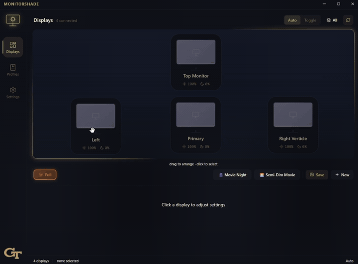
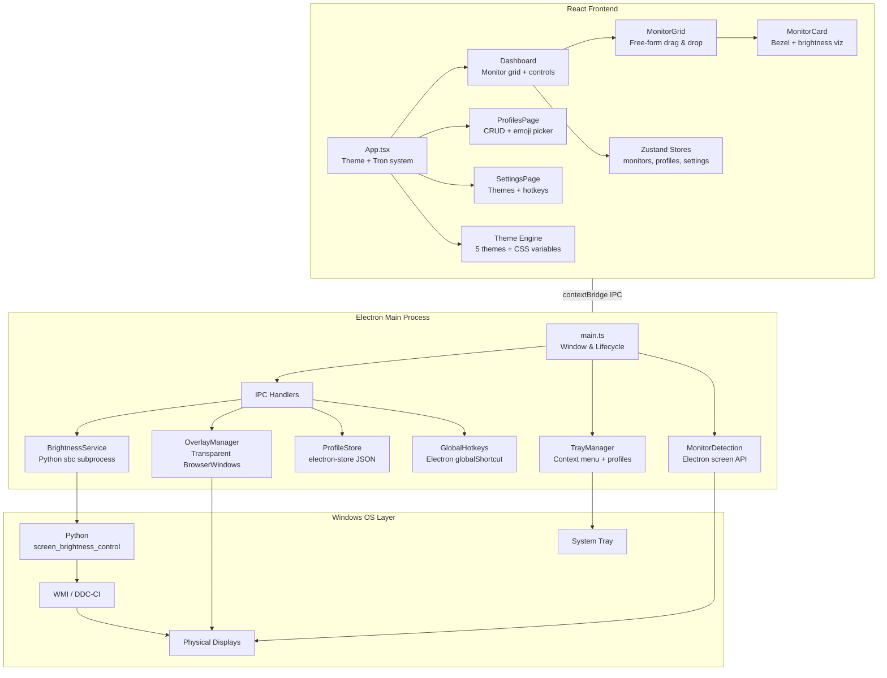
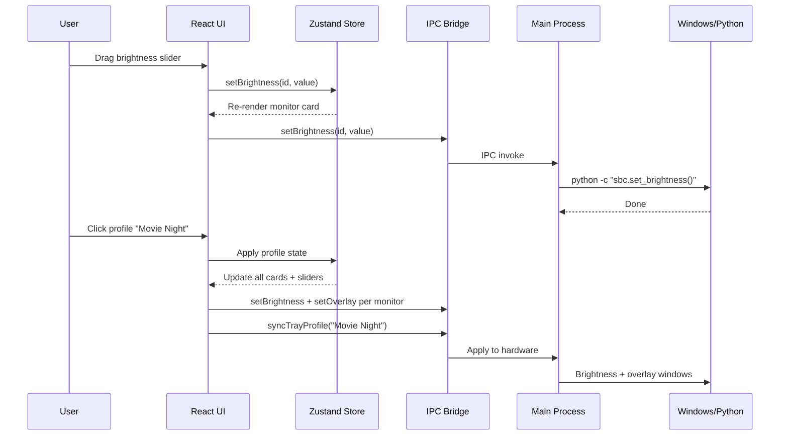

<div align="center">

# MonitorShade

**Multi-monitor brightness control for Windows.**
Dim any screen beyond hardware limits. Save profiles. Switch with a hotkey.

[](https://github.com/rundowntown/monitorShade)
[](https://github.com/rundowntown/monitorShade/releases)
[](https://www.electronjs.org/)
[](https://react.dev/)
[](https://www.typescriptlang.org/)
[](LICENSE)

</div>

---

> Whether you're reducing eye strain at night, setting up a dark room for movies, or just want your side monitors dimmer while you work — MonitorShade has you covered.

<p align="center">
  
</p>

---

## Getting Started

### Download & Install

| Method | How |
|---|---|
| **Installer** | Run `MonitorShade Setup 2.0.0.exe` — picks your install folder, adds a Start Menu shortcut |
| **Portable** | Run `MonitorShade.exe` from the `win-unpacked` folder — nothing installed, just run it |

Both are in the `screendim/release/` folder.

### Requirements

- **Windows 10 or 11**
- **Python 3.8+** (optional) — only needed if you want to control your monitor's *actual hardware brightness* via DDC/CI. Install the dependency with:

```
pip install screen-brightness-control
```

If you skip Python, the **dark overlay** still works — it places a transparent tinted layer over your screen to reduce brightness visually.

---

## How It Works

MonitorShade gives you two ways to dim a screen:

| Method | What it does | Python required? |
|---|---|---|
| **Hardware brightness** | Talks directly to your monitor to change its backlight level (0–100%) | Yes |
| **Dark overlay** | Places a transparent colored layer on top of your screen, dimming it beyond what the hardware slider can reach | No |

You can use either or both at the same time. The overlay is especially useful for screens that don't support DDC/CI (like many laptops) or when you need to go *darker than dark*.

---

## Using the App

### Dashboard

Open MonitorShade and you see your monitors laid out visually. Each one shows its current brightness and has its own slider.

| Action | What happens |
|---|---|
| **Click a monitor** | Select it — adjust brightness or overlay independently |
| **"Control All" toggle** | Adjust every monitor at once |
| **Drag a monitor** | Rearrange the canvas to match your physical desk layout |
| **Double-click a name** | Rename it (e.g., "Display 2" → "Right Ultrawide") |

### Modes

| Mode | Behavior |
|---|---|
| **Auto** | Set your levels and they stay put |
| **Toggle** | Flip between two brightness presets with a hotkey — dim ↔ bright in one keystroke |

### Profiles

Save any setup as a **profile** you can recall instantly:

1. Adjust your monitors how you like them
2. Click **Save** — name it and pick an emoji (e.g., 🎬 Movie Night)
3. Restore it anytime from the app or the system tray

### System Tray

Closing the window doesn't quit MonitorShade — it stays in your system tray. Right-click the icon to:

- **Switch profiles** without opening the window
- **Full Power** — reset all monitors to 100%
- **Open** or **Quit**

### Global Hotkeys

Assign a shortcut (e.g., `Ctrl+Shift+D`) in **Settings → Hotkeys**. Works even when MonitorShade is in the background — no need to alt-tab.

### Themes

Five built-in themes: **Dark** · **Light** · **Midnight** · **Forest** · **Georgia Tech**

When your screens are dimmed low, the UI automatically flips to high-contrast **Tron mode** so controls stay readable. You can also drag-and-drop a custom logo onto the sidebar for each theme.

---

## What's New in v2.0

Complete rewrite from Python/PySide6 to **Electron + React + TypeScript**.

| Area | What changed |
|---|---|
| **UI** | Free-form drag-and-drop monitor grid, 5 themes, animated canvas border |
| **Profiles** | Named presets with emoji icons, one-click switching from app or tray |
| **Overlay** | Per-monitor dark overlays that dim beyond hardware limits |
| **Hotkeys** | Global shortcuts that work even when the app is unfocused |
| **Tray** | Runs in background, profile switching from system tray |
| **Architecture** | Multi-process Electron with IPC bridge, Zustand state, Python subprocess for DDC/CI |

---

## For Developers

<details>
<summary><strong>Dev setup, build commands, tech stack, and project structure</strong></summary>

<br>

### Quick Start

```bash
cd screendim
npm install
```

### Run in development

```bash
npm run dev
```

Starts Vite (frontend), TypeScript watcher (main process), and Electron concurrently.

### Build

```bash
npm run build              # Compile main + renderer
npm run electron:build     # Package as .exe installer
```

### Tech Stack

| Layer | Technology |
|---|---|
| Framework | Electron 34 |
| Frontend | React 19 + TypeScript |
| Build | Vite 6 |
| Styling | Tailwind CSS 3 |
| State | Zustand 5 |
| Persistence | electron-store 8 |
| Brightness | Python screen_brightness_control (via subprocess) |
| Packaging | electron-builder 25 |

### Project Structure

```
screendim/
  src/
    main/                    # Electron main process
      main.ts                # Window management, app lifecycle
      preload.ts             # Secure IPC bridge
      services/
        brightness.ts        # WMI/DDC brightness via Python sbc
        overlay.ts           # Transparent overlay windows
        profiles.ts          # electron-store persistence
        monitors.ts          # Display detection
        tray.ts              # System tray with profile switching
        hotkeys.ts           # Global keyboard shortcuts
      ipc/
        handlers.ts          # IPC message handlers
    renderer/                # React frontend
      App.tsx                # Root with theme + tron system
      pages/
        Dashboard.tsx        # Main displays + controls page
        ProfilesPage.tsx     # Profile management with emoji picker
        SettingsPage.tsx     # Themes, hotkeys, general settings
      components/
        layout/              # TitleBar, Sidebar, AppLogo
        monitors/            # MonitorCard, MonitorGrid (drag & drop)
        controls/            # BrightnessSlider, OverlaySlider, ModeToggle
      stores/                # Zustand state (monitors, profiles, settings)
      hooks/                 # useMonitors, useBrightness, useProfiles, useTheme
      themes/                # 5 theme definitions with CSS variable system
      styles/                # Global CSS, animations, slider styling
    shared/
      types.ts               # Shared TypeScript interfaces
      constants.ts           # IPC channels, defaults
  assets/
    icons/                   # App icons (.ico, .png)
  legacy/                    # Original Python v1.0 (monitorShade.py)
```

</details>

---

## Architecture



### Data Flow



---

## Legacy (v1.0)

The original Python/PySide6 application is preserved in `legacy/monitorShade.py` for reference.

---

<div align="center">

**MIT License** · © 2025 Daniel Forcade

*Built with Electron, React, TypeScript, and too many late nights staring at bright monitors.*

</div>
