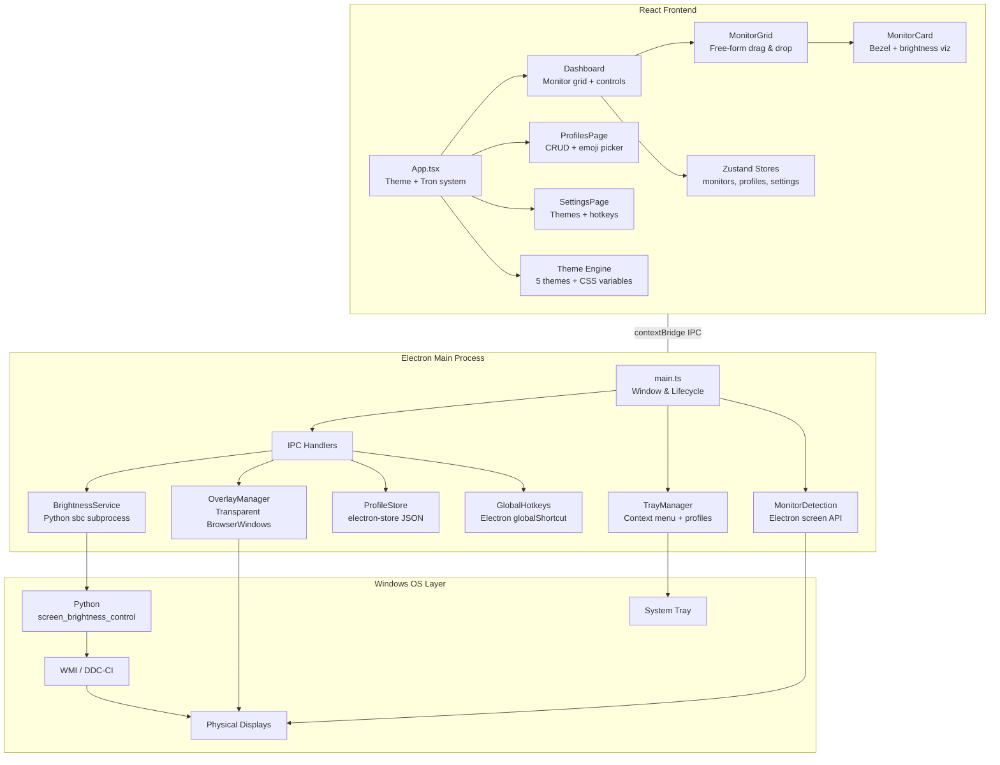
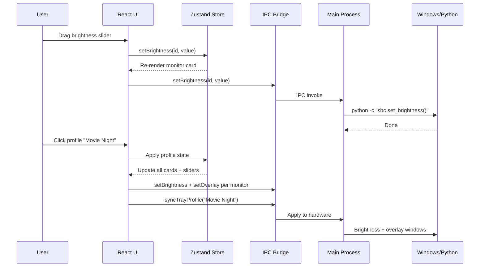

# MonitorShade

Multi-monitor brightness & dark overlay control for Windows. Dim your screens far beyond hardware limits.

---

## What's New in v2.0

Complete rewrite from Python/PySide6 to **Electron + React + TypeScript**. New features include:

- **Free-form monitor arrangement** — drag monitors to match your physical desk layout
- **Custom monitor names** — double-click to rename "Display 1" to "Left Ultrawide"
- **Profile system with emoji icons** — save and switch configurations with one click
- **System tray integration** — switch profiles and reset brightness from the tray
- **5 built-in themes** — Dark, Light, Midnight, Forest, Georgia Tech
- **Custom logo per theme** — drag and drop your own logo onto the sidebar
- **Tron dark mode** — UI shifts to orange when screens go dark so controls stay visible
- **Animated canvas border** — slow-moving lava trail around the monitor area
- **Global hotkeys** — work even when the app is unfocused
- **Close to tray** — app stays running in the background
- **True per-monitor DDC/CI brightness** via Python's `screen_brightness_control`
- **Dark overlay with color options** — black, warm, amber, night blue, darkroom red, sepia

---

## Features

| Feature | Description |
|---|---|
| **Per-monitor brightness** | Individual brightness control (0-100%) for each display |
| **Dark overlay** | Semi-transparent overlay that dims beyond hardware limits |
| **Auto mode** | Set brightness and forget |
| **Toggle mode** | Switch between two brightness presets with a hotkey |
| **Profiles** | Save/load named configurations with emoji icons |
| **Full reset** | One-click return to 100% brightness on all monitors |
| **System tray** | Quick profile switching without opening the app |
| **Monitor arrangement** | Drag monitors to match your physical layout |
| **Custom names** | Double-click any monitor label to rename it |
| **Themes** | 5 colorways with animated borders and dark-mode awareness |
| **Custom logos** | Drag and drop images per theme |

---

## Installation

### Option 1: Installer
Run `screendim/release/MonitorShade Setup 2.0.0.exe` — standard Windows installer with directory selection.

### Option 2: Portable
Run `screendim/release/win-unpacked/MonitorShade.exe` directly. No installation needed.

### Prerequisites
- **Windows 10/11**
- **Python 3.8+** with `screen_brightness_control` installed (for hardware brightness):
  ```
  pip install screen-brightness-control
  ```
  The dark overlay feature works without Python.

---

## Development

### Setup
```bash
cd screendim
npm install
```

### Run in development
```bash
npm run dev
```
This starts Vite (frontend), TypeScript watcher (main process), and Electron concurrently.

### Build
```bash
npm run build              # Compile main + renderer
npm run electron:build     # Package as .exe installer
```

---

## Architecture



### Data Flow



---

## Tech Stack

| Layer | Technology |
|---|---|
| Framework | Electron 34 |
| Frontend | React 19 + TypeScript |
| Build | Vite 6 |
| Styling | Tailwind CSS 3 |
| State | Zustand 5 |
| Persistence | electron-store 8 |
| Brightness | Python screen_brightness_control (via subprocess) |
| Packaging | electron-builder 25 |

---

## Project Structure

```
screendim/
  src/
    main/                    # Electron main process
      main.ts                # Window management, app lifecycle
      preload.ts             # Secure IPC bridge
      services/
        brightness.ts        # WMI/DDC brightness via Python sbc
        overlay.ts           # Transparent overlay windows
        profiles.ts          # electron-store persistence
        monitors.ts          # Display detection
        tray.ts              # System tray with profile switching
        hotkeys.ts           # Global keyboard shortcuts
      ipc/
        handlers.ts          # IPC message handlers
    renderer/                # React frontend
      App.tsx                # Root with theme + tron system
      pages/
        Dashboard.tsx        # Main displays + controls page
        ProfilesPage.tsx     # Profile management with emoji picker
        SettingsPage.tsx     # Themes, hotkeys, general settings
      components/
        layout/              # TitleBar, Sidebar, AppLogo
        monitors/            # MonitorCard, MonitorGrid (drag & drop)
        controls/            # BrightnessSlider, OverlaySlider, ModeToggle
      stores/                # Zustand state (monitors, profiles, settings)
      hooks/                 # useMonitors, useBrightness, useProfiles, useTheme
      themes/                # 5 theme definitions with CSS variable system
      styles/                # Global CSS, animations, slider styling
    shared/
      types.ts               # Shared TypeScript interfaces
      constants.ts           # IPC channels, defaults
  assets/
    icons/                   # App icons (.ico, .png)
  legacy/                    # Original Python v1.0 (monitorShade.py)
```

---

## Legacy (v1.0)

The original Python/PySide6 application is preserved in `legacy/` for reference. See `legacy/monitorShade.py` for the source.

---

## License

MIT License © 2025 daniel forcade
